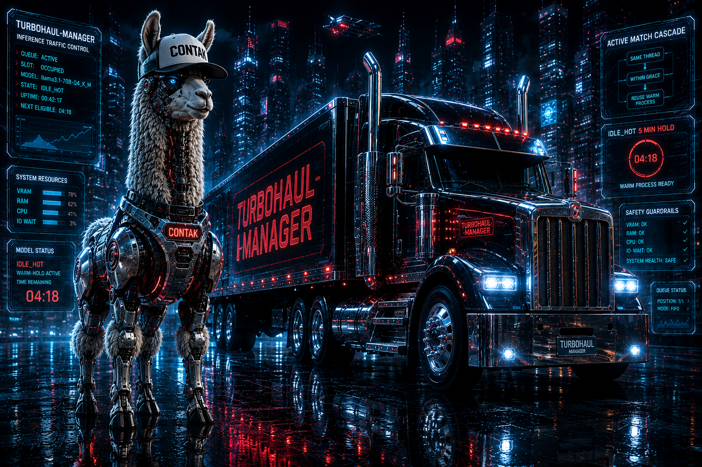

# Turbohaul-Manager

Ollama-shape inference manager using [Tom's TurboQuant](https://github.com/TheTom/llama-cpp-turboquant) fork of llama.cpp.

FIFO queue + grace + IDLE_HOT hot-hold + model swap on Nvidia RTX GPU's including Blackwell.

## What it does

- Accepts OpenAI / Ollama-shape `/v1/chat/completions` requests
- Single-slot serial sidecar (one llama-server child holds the model)
- ACTIVE_MATCH cascade for same-thread follow-ups within a grace window (warm-process reuse)
- IDLE_HOT 5-minute warm-hold after grace expires: same-model follow-ups inherit the warm process; different-model swap tears down + spawns new
- Multiplexed multi-agent serialization on one shared GPU (proven in production with 3 concurrent agents — see [docs/MULTI_AGENT_SHARING.md](docs/MULTI_AGENT_SHARING.md))
- Transparent tool-call recovery for jinja-templated GGUFs that emit calls as text JSON in `message.content` instead of the structured `tool_calls` field (notably Qwen3-family per upstream llama.cpp issues #20809 / #20837 / #20260) — see [docs/TOOL_CALL_HANDLING.md](docs/TOOL_CALL_HANDLING.md)
- Safety guardrails: refuses spawn when VRAM / RAM / CPU / IO-wait would put the host at risk

## Quick start

```bash
# Run the CUDA variant (Blackwell or older NVIDIA GPU)
docker run --gpus all -p 11401:11401 \
    -v $(pwd)/state:/var/lib/turbohaul \
    -v $(pwd)/models:/var/lib/turbohaul/import-staging \
    ghcr.io/MrTrenchTrucker/turbohaul-manager:v0.2.3

# Or build locally
git clone https://github.com/MrTrenchTrucker/turbohaul-manager.git
cd turbohaul-manager
docker build -f Dockerfile.cuda -t turbohaul-manager:v0.2.3 .
```

The `-v $(pwd)/state:/var/lib/turbohaul` mount is **required** for production deployment — without it, `state.sqlite`, `manifests/*.yaml`, and the `blobs/` store live inside the container layer and are destroyed by `docker rm` or container-layer corruption.

## API

Compatible with Ollama-shape clients:
- `GET /api/tags` -- list models
- `GET /api/show?name=<tag>` -- model detail
- `POST /v1/chat/completions` -- OpenAI-shape inference (supports `response_format` json_object + json_schema)
- `POST /api/chat` -- Ollama-shape inference
- `POST /v1/embeddings` -- llama-server embeddings passthrough
- `GET /v1/logging` -- paginated audit events
- `PUT /api/manifests/{tag}` -- register a new model (requires GGUF blob in store; ETag/If-Match atomic concurrency)
- `POST /api/pull-hf` -- pull a GGUF from HuggingFace
- `POST /api/pull-url` -- pull a GGUF from arbitrary HTTPS URL (SSRF-guarded)
- `POST /api/import` -- import a local GGUF file
- `GET /status` -- live queue + active + idle_hot snapshot

## Setting up AI Agents

Pointing an AI agent (Hermes, langchain, llama-index, LiteLLM, raw OpenAI SDK, Ollama clients, etc.) at Turbohaul is two lines:

```yaml
base_url: http://<turbohaul-host>:11401/v1
api_key: dummy   # no auth required on the local inference port
```

Turbohaul ships with sane defaults for multi-tool-call agent loops — `idle_hot_load_seconds=600`, `grace_seconds=30`, streaming SSE pass-through, tool-call field forwarding on both `/v1/chat/completions` and `/api/chat`, text-JSON tool-call recovery for jinja-template models that emit calls as content text, and ACTIVE_MATCH warm-slot reuse for same-`thread_id` follow-ups (sub-second after the first turn).

**Full guide:** [docs/AI_AGENT_SETUP.md](docs/AI_AGENT_SETUP.md) — per-agent config recipes (Hermes / OpenAI SDK / langchain / llama-index / LiteLLM / Ollama / curl), multi-tool-call workflow notes, production setup, validation smoke tests, and a troubleshooting table. For the recovery layer specifically, see [docs/TOOL_CALL_HANDLING.md](docs/TOOL_CALL_HANDLING.md).

## Multi-agent shared-GPU

Multiple agents can target the same Turbohaul endpoint at the same time. Turbohaul queues their requests, holds the warm model when possible, and cleanly swaps models when a different agent needs a different one.

This is sharing-via-serialization, not concurrent-tensor-parallelism. See [docs/MULTI_AGENT_SHARING.md](docs/MULTI_AGENT_SHARING.md) for the architecture, the proof, and when this does (and does not) fit your workload. It has been validated in production with three concurrent agents (one worker plus two advisor reasoning models) running on one Blackwell card with zero force-evictions during a multi-model serialization smoke.

## TurboQuant flag doctrine

The Turbohaul manifest schema includes five spawn-time TurboQuant flags that should be on by default for production manifests: `flash_attn`, `no_context_shift`, `cache_reuse: 256`, `slot_prompt_similarity: 0.5`, `no_perf`. These are spawn argv — manifest PUT does not affect a running `llama-server`; a cold-spawn (request with body `"keep_alive": 0`, natural `IDLE_HOT` teardown, or container restart) is required to pick up changes.

See [docs/TURBOQUANT_FLAGS.md](docs/TURBOQUANT_FLAGS.md) for the spawn-vs-request distinction, patching recipe, and verification recipe.

## Persistence

Production deployments must bind-mount `/var/lib/turbohaul`, ship an image tarball backup, mirror configs to a separate host, and have an auto-recovery entry.

## License

MIT (see LICENSE). All third-party deps audited MIT-compatible (see THIRD_PARTY_NOTICES.md).

## Contributors

See [CONTRIBUTORS.md](CONTRIBUTORS.md). MrTrench (founder) shipped v0.2.3. Release notes in [CHANGELOG.md](CHANGELOG.md).
